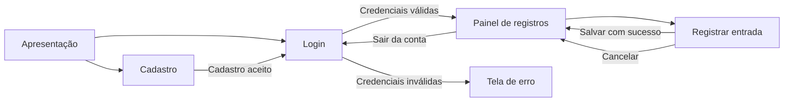
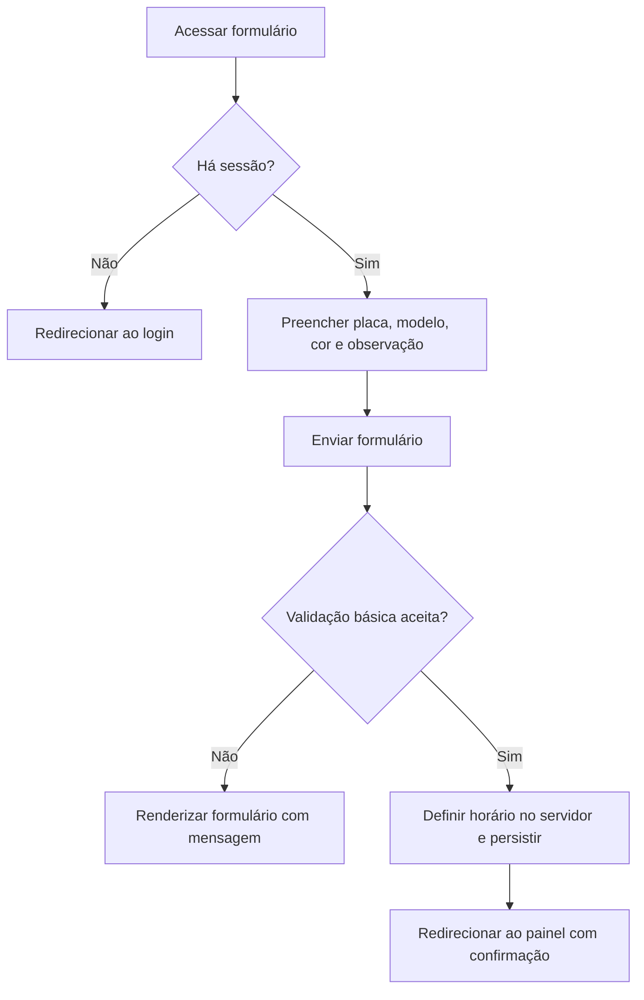
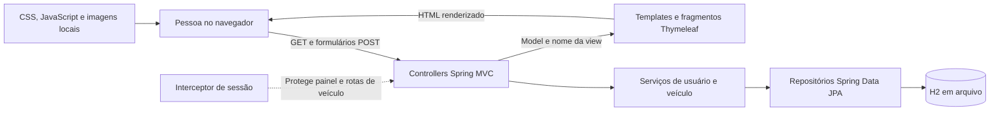
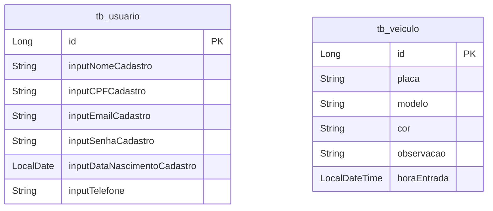

# System Design — Estacionamento escolar

**Estado: descoberta técnica e protótipo visual concluídos; rotina operacional e fotografias físicas pendentes.**

Este documento confronta o briefing com o código disponível. Não representa aprovação do escopo operacional nem um Design System final. As funcionalidades existentes são evidência da implementação, não confirmação das necessidades da escola.

## 1. Decisões confirmadas e limites do trabalho

- O produto será utilizado por pessoas sem conhecimento técnico. A interface deve orientar ações com linguagem direta, rótulos explícitos e erros recuperáveis.
- As pessoas que operam o sistema cuidarão de todos os veículos, conforme confirmação do usuário. A consulta é global; quem pode obter uma conta operacional ainda precisa ser definido.
- O usuário está desenvolvendo o backend. Nesta etapa, preservar os arquivos Java; alterações de interface podem ocorrer em HTML/Thymeleaf, CSS, JavaScript e recursos visuais.
- Preservar os contratos atuais dos formulários durante as alterações de frontend. Dependências de backend serão documentadas para o usuário.
- O usuário autorizou um protótipo no Pen a partir de três referências de interface e um vídeo. A direção visual desta exploração se baseia nesses materiais; a identidade do espaço físico permanece pendente de fotografias reais.
- Implementação de novas funcionalidades depende da consolidação dos requisitos essenciais e da estrutura inicial.
- Pen/Pencil.dev está acessível. O protótipo possui oito telas editáveis, três componentes reutilizáveis e pranchas de direção, estados e storyboard. A landing desktop/móvel foi solicitada pelo usuário e prevê futura animação de imagens no Higgsfield. Consulte [a entrega do protótipo](prototipo-pen/README.md).

## 2. Evidências, hipóteses e lacunas

| Tema | Evidência disponível | Consequência para o projeto |
| --- | --- | --- |
| Aplicação | `pom.xml` declara Java 25, Spring Boot 4.1.0, MVC, Thymeleaf, JPA e H2 | Há uma base integrada; manter essa estrutura é a proposta inicial |
| Acesso | Cadastro público e login por e-mail/senha; sessão nas rotas operacionais | Existe autenticação didática; ainda não há papéis ou escopo por pessoa |
| Operação | Registro de placa, modelo, cor, observação e horário de entrada | A interface pode apresentar entradas registradas |
| Saída | Não há campo, regra ou rota de saída; o painel a indica em desenvolvimento | Não apresentar permanências encerradas ou ocupação atual |
| Vagas | Não há entidade, capacidade ou mapa operacional | Não desenhar uma planta como se representasse vagas reais |
| Usuários | O usuário informou “pessoas comuns”, responsáveis por todos os veículos | Consulta global confirmada; concessão de acesso ainda pendente |
| Ambiente real | Sem fotografias confirmadas ou descrição da rotina | Entradas, saídas, circulação, capacidade e equipamentos permanecem desconhecidos |
| Integrações | Pen respondeu à consulta de estado | Conexão verificada; não há confirmação de sensores, câmeras ou catracas |

### Imagem que já existe

`hero-estacionamento.png` foi inspecionada. É possível observar veículos, marcações no piso, uma estrutura elevada, iluminação violeta e uma grande interface digital sobreposta. A imagem não comprova que esse seja o estacionamento escolar nem permite inferir sua operação. A origem e o processo de produção da imagem não foram verificados nesta etapa.

`docs/ASSETS.md` descreve essa imagem como referência da interface anterior. Essa escolha histórica não fixa a direção visual do novo briefing. Não extrair dela quantidade real de vagas, infraestrutura instalada ou cores institucionais.

### Informações necessárias para avançar

| Decisão pendente | O que esclarecer | O que depende dela |
| --- | --- | --- |
| Concessão de acesso | Quem pode criar uma conta e passar a operar todos os veículos? | Cadastro público versus acesso controlado |
| Rotina atual | Quem registra entrada/saída, em qual dispositivo e como isso acontece hoje? | Fluxos, prioridades e tratamento de falhas |
| MVP | Quais tarefas precisam funcionar na primeira versão? | Critérios de aceitação e ordem do desenvolvimento |
| Referências físicas | Fotos de visão geral, acessos, circulação e sinalização, com breve identificação de cada local | Direção visual e interpretação espacial |
| Dados pessoais | Por que CPF, telefone e nascimento são necessários? Quem consulta e por quanto tempo? | Formulários, minimização e retenção |

## 3. Mapa funcional e permissões atuais

| Função | Implementação observada | Acesso atual | Validação operacional |
| --- | --- | --- | --- |
| Apresentação | Página pública `/` | Qualquer visitante | Necessidade e conteúdo institucional pendentes |
| Criar conta | Cadastro e verificação de e-mail já existente | Público | Cadastro aberto precisa ser confirmado |
| Entrar e sair da conta | Login, renovação do ID de sessão e logout por POST | Visitante / pessoa autenticada | Identificação necessária ainda deve ser validada |
| Consultar registros | Lista todos os registros de veículos | Qualquer pessoa autenticada | Escopo global confirmado; concessão de acesso pendente |
| Registrar entrada | Cria um registro com horário do servidor | Qualquer pessoa autenticada | Confirmar responsável e dados obrigatórios |
| Registrar saída | Ausente | Nenhum | Candidata, não aprovada |
| Consultar vagas livres | Ausente | Nenhum | Depende de operação, capacidade e registros confiáveis |

Não atribuir automaticamente papéis de aluno, professor, visitante ou administrador. Chamar a listagem de registros do estacionamento: o usuário confirmou a operação de todos os veículos, e não existe vínculo de propriedade no modelo.

### Navegação existente

### Entrada: fluxo técnico existente

O redirecionamento após sucesso evita repetir o POST ao atualizar o painel. Ele não impede dois envios concorrentes nem entradas duplicadas. As validações verificam campos e limites, sem normalização de placa ou regra de permanência ativa.

## 4. Arquitetura observada e proposta inicial

**Proposta técnica, ainda sujeita ao escopo:** continuar com uma aplicação Spring e frontend renderizado no servidor. As operações disponíveis não demonstram necessidade de SPA, API JSON separada, microsserviços ou comunicação em tempo real.

O servidor mantém sessão, dados e resultado das operações. JavaScript deve cuidar de interações locais, como mostrar senha e feedback de envio. Autorização e verdade dos registros pertencem ao backend; filtrar ou ocultar elementos no navegador não restringe acesso aos dados.

### Responsabilidades dos módulos

| Módulo | Responsabilidade | Limite atual / direção proposta |
| --- | --- | --- |
| Acesso | Cadastro, autenticação e sessão | Regras de credenciais estão no controller; documentar evolução de segurança para o usuário |
| Registro de entrada | Receber dados, validar regras e persistir a chegada | A interface atual `cadastrarVeiculo` mistura nome de cadastro permanente com evento de entrada; esclarecer o conceito antes de renomear ou remodelar |
| Consulta | Disponibilizar registros visíveis para quem acessa | Atualmente chama `findAll`; escopo global confirmado, ordenação e paginação dependem da operação |
| Apresentação | Renderizar conteúdo, formulários, estados e navegação | Compartilhar fragmentos e estilos; preservar campos e rotas existentes |

`UsuarioService` declara atualização, exclusão e listagem, mas as implementações são vazias. Isso não constitui funcionalidades prontas. As operações de atualizar/excluir veículo no serviço também não têm fluxos expostos nos controllers lidos.

Manter a organização existente de `controller/`, `service/`, `repository/`, `entity/` e `model/` nesta etapa. Evoluir regras por operação evita espalhar decisões entre controller, JavaScript e template. Mudanças Java serão realizadas pelo usuário.

## 5. Dados e integridade

Modelo encontrado nas entidades, sem relações declaradas entre elas:

As entidades declaram IDs gerados. Não declaram chaves estrangeiras, unicidade de e-mail/placa ou obrigatoriedade de colunas. Isso descreve o mapeamento Java, não uma inspeção do banco local. O arquivo de dados não foi aberto nesta etapa.

### Decisões de modelagem a validar

- **Veículo versus visita:** o registro atual contém características do veículo e uma chegada. Se visitas recorrentes e saída entrarem no escopo, avaliar separar a identidade do veículo do registro de permanência. Não criar essa estrutura antes da decisão.
- **Reentrada:** definir se uma placa pode ter mais de uma permanência aberta, como corrigir erros e como tratar registros antigos sem saída. Nunca converter automaticamente todos os registros antigos em veículos presentes.
- **Pessoa versus veículo:** vínculo só será necessário se a operação exigir identificação de responsável ou acesso individual. Não inventar titularidade a partir de login.
- **Horários:** hoje são `LocalDateTime.now()` do servidor. Definir fuso e origem oficial do horário antes de comparações, duração e saída.
- **Concorrência:** regras de unicidade e transições precisam de garantia no banco/transação quando forem implementadas. Desabilitar um botão melhora o feedback, mas não garante integridade.

## 6. Contratos HTTP existentes para preservar no frontend

São páginas HTML e formulários. Não há API REST JSON nos controllers examinados.

| Método e rota | Dados enviados | Resultado observado |
| --- | --- | --- |
| `GET /` | — | Template `index` |
| `GET /login` | — | Template `login` |
| `GET /cadastro` | — | Template `cadastro` |
| `POST /efetuarCadastro` | `inputNomeCadastro`, `inputCPFCadastro`, `inputEmailCadastro`, `inputSenhaCadastro`, `inputDataNascimentoCadastro`, `inputTelefone` | Sucesso redireciona ao login; erro retorna cadastro com `erroCadastro` |
| `POST /autenticar` | `inputEmail`, `inputSenha` | Sucesso cria/renova sessão e redireciona ao painel; falha retorna `erro` |
| `GET /painel` | Cookie de sessão | Template `painel`, atributo `veiculos` |
| `GET /veiculo/registrar-entrada` | Cookie de sessão | Template `registrar-entrada` |
| `POST /veiculo/cadastrar` | `placa`, `modelo`, `cor`, `observacao`; cookie de sessão | Sucesso redireciona ao painel; erro retorna formulário com `erroEntrada` |
| `POST /sair` | Sessão, quando existente | Invalida sessão e redireciona ao login |

Formulários usam codificação padrão `application/x-www-form-urlencoded`. O horário é atribuído no serviço; não enviar um horário escolhido no navegador como se fosse a entrada efetiva.

O interceptor redireciona acessos sem sessão a `/login`. Não há resposta específica de permissão insuficiente por perfil. A autenticação inválida retorna uma view, não um contrato JSON de erro. Preservar `name`, `action`, métodos e atributos Thymeleaf ao alterar layouts.

## 7. Segurança e privacidade: dependências para o backend

O código persiste a senha recebida e a compara diretamente no login. A dependência Spring Security não aparece no `pom.xml`; a proteção de operações usa um interceptor de sessão. O console H2 está habilitado na configuração local. Esses pontos limitam o uso com dados reais.

Para evolução pelo usuário: adotar armazenamento unidirecional de senha e proteção CSRF nas operações por sessão, junto de autorização conforme os perfis confirmados. O frontend precisará receber e enviar o token quando essa proteção existir. Referências: [armazenamento de senhas](https://docs.spring.io/spring-security/reference/features/authentication/password-storage.html) e [CSRF no Spring Security](https://docs.spring.io/spring-security/reference/servlet/exploits/csrf.html).

A LGPD estabelece finalidade, necessidade e segurança no tratamento. A escola precisa definir finalidade, hipótese legal aplicável, acesso e retenção; não presumir consentimento como solução universal. Se houver dados de crianças ou adolescentes, avaliar também o art. 14. Referência: [LGPD, arts. 6, 7, 14 e 46](https://www.planalto.gov.br/ccivil_03/_ato2015-2018/2018/lei/l13709compilado.htm).

Aplicação ao projeto: justificar CPF, nascimento e telefone antes de mantê-los no escopo final; limitar observações a informações operacionais; evitar dados pessoais em exemplos e logs. Os campos obrigatórios atuais não podem ser retirados apenas do HTML, pois o controller rejeitaria o cadastro. Mudanças de coleta precisam ser coordenadas com o usuário.

## 8. Preparação da experiência e do Design System

**Direção visual exploratória criada por solicitação do usuário.** As três imagens anexadas são referências de aplicativos/sites, e o vídeo apresenta um site de produto. Não são evidências da escola. O protótipo combina navegação grafite, área de trabalho clara, ação azul, Manrope para leitura e IBM Plex Mono para placas. A direção é uma proposta para validação, sem representar uma identidade institucional confirmada. O tema escuro/violeta do frontend existente permanece preservado.

### Método de análise das fotografias

Para cada imagem recebida, registrar: identificação do local; o que está diretamente visível; limitações de enquadramento/luz; hipóteses; perguntas de validação; possíveis relações com o produto. Uma marcação no piso não comprova capacidade total, e um portão não comprova seu uso como entrada ou saída.

Só depois relacionar elementos observados com composição, divisórias, orientação, ritmo e cores funcionais. Comparar poucas propostas no Pen com justificativas rastreáveis às referências e tarefas. Testar contraste antes de consolidar a paleta.

### Componentes e estados explorados, limitados aos fluxos existentes

| Componente | Função | Estados a especificar no Pen |
| --- | --- | --- |
| Cabeçalho operacional | Identificar página e ações disponíveis | Visitante / autenticado, foco, navegação compacta |
| Campo com rótulo e ajuda | Receber um dado compreensível | Vazio, preenchido, foco, inválido, indisponível quando aplicável |
| Ação primária/secundária | Salvar, cancelar ou navegar | Repouso, foco, pressionado, envio em andamento |
| Mensagem contextual | Explicar resultado e próxima ação | Erro, confirmação e ausência de dados; texto além da cor |
| Lista de registros | Reconhecer veículo e horário | Vazia, preenchida e variação móvel |

### Comportamentos desejados e dependências

| Situação | Comportamento proposto | Dependência |
| --- | --- | --- |
| Lista vazia | Explicar que não há registros no estacionamento e apresentar a ação pertinente | Escopo global confirmado; definir tarefas do MVP |
| Envio | Feedback de andamento e prevenção de cliques repetidos | Já existe `ui.js`; verificar retorno e navegação no navegador |
| Validação rejeitada | Explicar o problema junto ao campo e preservar dados não sensíveis | Mensagens atuais são gerais; erros estruturados podem exigir backend |
| Sucesso | Confirmar apenas depois da resposta de persistência | Usar o atributo `sucesso` existente |
| Sessão expirada | Orientar retorno ao login sem afirmar que a operação foi concluída | Hoje há apenas redirecionamento; motivo explícito depende do backend |
| Conexão interrompida | Evitar confirmar gravação ou repetir envio automaticamente | Pode haver resultado incerto; estratégia precisa ser validada com o fluxo |
| Permissão insuficiente | Explicar acesso indisponível e oferecer retorno seguro | Perfis e autorização ainda ausentes |

### Responsividade, leitura e movimento

Requisito de projeto: hierarquia rápida de ler, ações com verbos concretos e placa/horário fáceis de localizar. A apresentação institucional, se mantida, deve ter propósito confirmado e não atrasar o acesso à operação.

No computador, avaliar tabela para comparação. No celular, avaliar linhas empilhadas com rótulos e prioridade para identificação/horário, mantendo acesso às informações secundárias. A escolha depende do volume e da tarefa; não fixar uma biblioteca inteira antes dessa validação.

Adotar contraste de pelo menos 4,5:1 para texto comum e 3:1 para texto grande, conforme a definição da WCAG. Testar foco, teclado, zoom, rótulos e mensagens; contraste sozinho não comprova acessibilidade. Referência: [WCAG — contraste mínimo](https://www.w3.org/WAI/WCAG22/Understanding/contrast-minimum.html).

Movimento deve comunicar mudanças de estado; respeitar `prefers-reduced-motion` e manter formulários e conteúdo utilizáveis sem JavaScript. A duração e os efeitos serão definidos ao testar os componentes, depois da análise fotográfica.

## 9. Plano condicionado às decisões

| Etapa | Entrega | Dependência | Critério de conclusão |
| --- | --- | --- | --- |
| Descoberta | Evidências do código, fotos anotadas e descrição da rotina | Fotos e respostas operacionais | Separação clara entre fatos, hipóteses e pendências |
| Definição | MVP, responsáveis, permissões e fluxos | Descoberta | Cada tarefa essencial tem responsável, dados, regras, alternativas e aceitação |
| Arquitetura | Modelagem e contratos consolidados | MVP | Nenhuma tela pressupõe dados ou ações sem suporte identificado |
| Direção visual | Poucas propostas fundamentadas no Pen | Fotos e fluxos | Justificativas visuais ligadas ao local e às tarefas |
| Design System | Tokens e componentes necessários, com estados | Direção escolhida | Consistência e contraste verificados |
| Prototipagem | Wireframes e telas de alta fidelidade, desktop e móvel | Componentes e contratos | Percursos essenciais compreensíveis e estados verificáveis |
| Frontend | Templates, estilos, scripts e recursos integrados | Protótipo e backend correspondente | Fluxos reais preservados, sem alteração de Java |
| Revisão | Verificação técnica e com usuários | Implementação | Critérios do MVP atendidos, inclusive falhas e acessibilidade |

**MVP:** ainda não confirmado. Cadastro/login, consulta e entrada formam a base disponível, não uma decisão automática sobre o produto final.

**Evoluções candidatas:** saída, histórico e correções, apenas conforme a rotina confirmada. Qualquer evolução que dependa de dados ou regras novas será encaminhada ao usuário responsável pelo Java.

**Possibilidades futuras:** reserva, pagamento, mapa de vagas, sensores e leitura automática de placas não pertencem ao escopo confirmado. Só avaliar após existir uma necessidade operacional demonstrada.

## 10. Validação

Foram lidos os controllers, entidades, models, serviços, repositórios, configuração de sessão, formulários principais, dependências e documentação existente. Na etapa do protótipo, as três referências visuais foram examinadas, e o vídeo foi amostrado em seis quadros. Os onze frames entregues no Pen passaram pela consulta estrutural de cortes, sem problemas reportados, e por inspeção visual. As prévias PNG foram exportadas. O storyboard da landing descreve produção futura; animações ainda não foram geradas ou implementadas.

`docs/VALIDACAO.md` registra resultados de uma entrega anterior; eles não foram revalidados aqui. O protótipo é visual e editável, sem navegação executável ou persistência. Não houve consulta aos registros do banco nem alteração de Java ou do frontend de produção.

Próximo passo: validar a direção visual e os fluxos do protótipo; esclarecer a rotina de entrada/saída e as tarefas obrigatórias do MVP. Fotografias reais permitirão estabelecer a conexão visual com o local. A operação de todos os veículos já foi confirmada.
